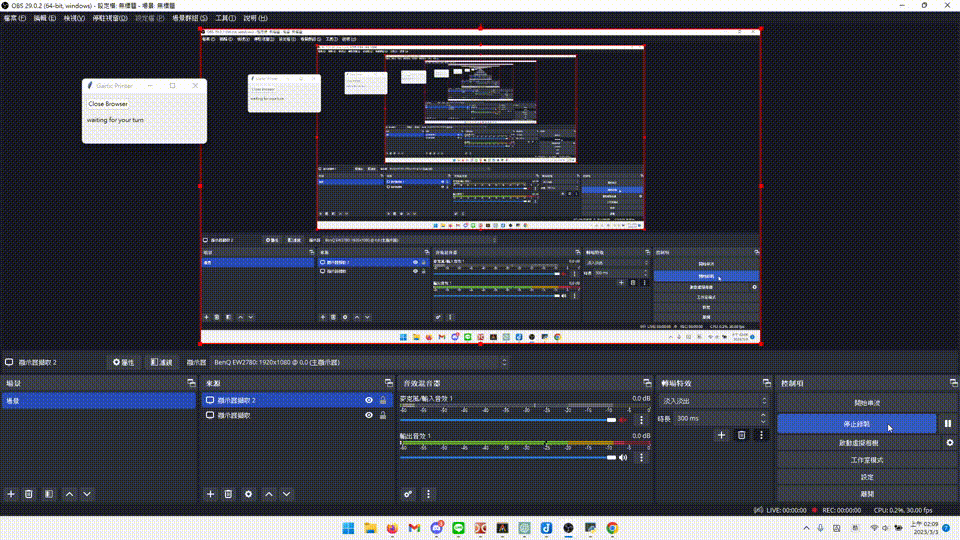

# Gartic.io Selenium Printer


[中文說明](https://github.com/FOBshippingpoint/garticio_selenium/blob/main/README_zh-TW.md)

<!--  -->

<!--  -->




A gartic.io drawing assistant desktop app.

## Usage

Download [latest program](https://github.com/FOBshippingpoint/garticio_selenium/releases/latest).

When it is your turn, the program will open a Google image search page with the specified keyword. You can then select the image you want to draw, and the program will start drawing it (more accurately, printing it).


## Prerequisite

[poetry](https://python-poetry.org/)

## Develop

```sh
git clone https://github.com/FOBshippingpoint/garticio_selenium.git garticio_selenium
cd garticio_selenium
poetry init
poetry install
poetry run python garticio_selenium/app.py
```

## Build

```sh
poetry run python build.py
```

## Authors

- [@FOBshippingpoint](https://www.github.com/FOBshippingpoint)
- [@Felian 1999](https://github.com/Felian1999)
- [@Elmer Chou](https://github.com/elmerchou)

## License

[MIT](https://choosealicense.com/licenses/mit/)
