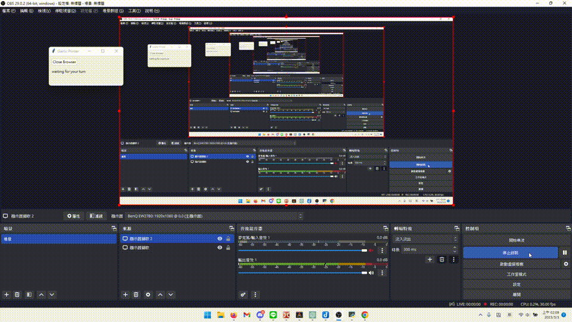

# Gartic.io 印表機




Gartic.io 的自動繪圖程式。

## 使用說明

至 [下載連結](https://github.com/FOBshippingpoint/garticio_selenium/releases/tag/Latest) 取得最新程式壓縮檔，解壓縮後進入`app`資料夾，開啟`app.exe`就會看到程式視窗。

點擊`Open Browser`開啟自動控制瀏覽器，加入房間後會看到`waiting for your turn.`，當輪到你作畫並選擇要畫的題目時，瀏覽器會自動開啟新分頁搜尋題目圖片，點擊你想畫的圖片以後程式就會開始自動列印（在此期間不要移動滑鼠、操作鍵盤），列印完成後會顯示`print complete`。

當繪圖時間結束，程式會顯示`waiting for your turn.`，代表準備下一輪作畫，若沒有顯示此訊息可能表示程式出錯，可以關掉重開。

### 注意事項

目前程式並沒有檢測使用者的顯示器大小，預設是 1920x1080 的螢幕解析度，所以如果你的螢幕不是此解析度可能會畫在錯誤的位置，亂點一通。

## 開發要求

- [poetry](https://python-poetry.org/)
- pip

## Develop

```sh
git clone https://github.com/FOBshippingpoint/garticio_selenium.git garticio_selenium
cd garticio_selenium
poetry init
poetry install
poetry run python garticio_selenium/app.py
```

## Build

```sh
poetry run python build.py
```

## Authors

- [@FOBshippingpoint](https://www.github.com/FOBshippingpoint)
- [@Felian 1999](https://github.com/Felian1999)
- [@Elmer Chou](https://github.com/elmerchou)

## License

[MIT](https://choosealicense.com/licenses/mit/)
